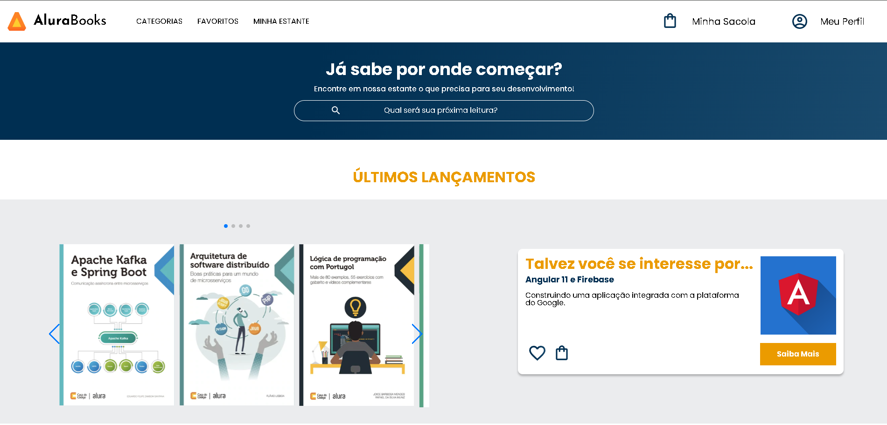

# Página AluraBooks feita em HTML e CSS

Este é um projeto do curso de HTML e CSS da Alura onde fazemos um site responsivo com a técnica 'Mobile First'.



## Descrição do Projeto

Esta página consiste no uso da técnica Mobile First, onde começamos com um site para smartphones e vamos adaptando o mesmo para telas maiores usando Media Queries, combinando dimensões diferentes para atender todos os requisítos.

[Link para a demonstração](https://leozings.github.io/alura-books/)

## Como Executar

Para executar este projeto localmente, siga os passos abaixo:

1. **Clone o repositório:**
    
    ```bash
    git clone https://github.com/LeozinGs/alura-books.git
    ```
    
2. **Navegue até o diretório do projeto.**
3. **Abra o arquivo `index.html` em seu navegador:**
    
    Basta dar um duplo clique no arquivo `index.html` ou abrir manualmente em seu navegador preferido.